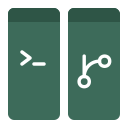
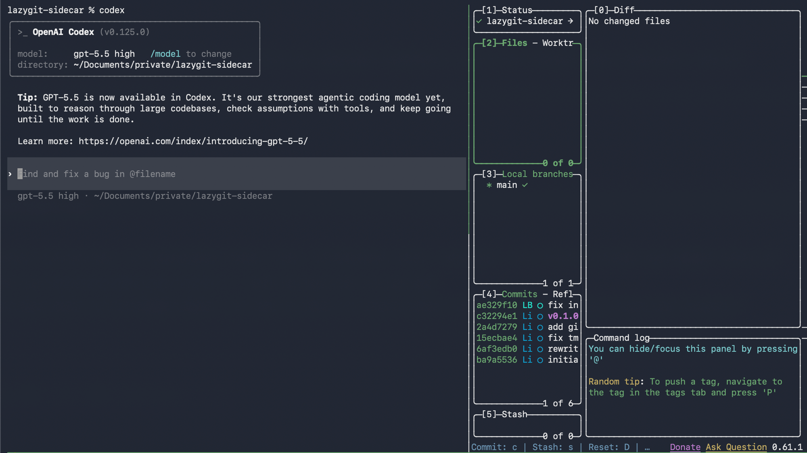

<p align="center">
  
</p>

<h1 align="center">lazygit-sidecar</h1>

<p align="center">
  See your git changes while you code. Always.
</p>

<p align="center">
  
</p>

## What is this?

When you work in the terminal, you constantly switch between your tool and git commands. lazygit-sidecar solves this by splitting your terminal in two: your tool on the left, a live git view on the right.

It works with any command-line tool: [Claude Code](https://claude.ai/code), [Codex](https://github.com/openai/codex), [Gemini CLI](https://github.com/google-gemini/gemini-cli), or just a plain shell.

## Install

macOS and Linux are supported natively. On Windows, lazygit-sidecar works inside [WSL](https://learn.microsoft.com/en-us/windows/wsl/install).

Make sure you have [tmux](https://github.com/tmux/tmux) (3.1 or newer), [lazygit](https://github.com/jesseduffield/lazygit), and bash 4+ installed, then run:

```sh
git clone https://github.com/Predixx/lazygit-sidecar.git
cd lazygit-sidecar
./install.sh
```

The installer walks you through every step and asks for confirmation before making any changes.

<details>
<summary><strong>Non-interactive install</strong></summary>

If you prefer to skip the prompts:

```sh
./install.sh --core
```

</details>

<details>
<summary><strong>Manual install</strong></summary>

```sh
install -m 0755 bin/lazygit-sidecar ~/.local/bin/lazygit-sidecar
```

If your terminal says `lazygit-sidecar: command not found`, add this line to your `~/.zshrc` (or `~/.bashrc`):

```sh
export PATH="$HOME/.local/bin:$PATH"
```

</details>

## Usage

Just put `lazygit-sidecar` in front of the command you normally use:

```sh
lazygit-sidecar claude
lazygit-sidecar codex
lazygit-sidecar zsh
```

That's it. Your terminal splits in two. Work on the left, git on the right.

When you're done, exit your tool as usual. Close the git view by pressing `q`.

> **Note:** You need to be inside a project folder that uses git. If you're not, your command runs normally without the git view.

## Uninstall

```sh
./install.sh --uninstall
```

<details>
<summary><strong>Troubleshooting</strong></summary>

**`lazygit-sidecar: command not found`**
`~/.local/bin` is likely not on your PATH. See the fix in [Install](#install).

**`already inside a tmux session`**
lazygit-sidecar opens its own terminal session and can't run inside one that's already open. Press `Ctrl-b d` to leave the current session first, then try again.

**`tmux 3.1+ required`**
Your tmux version is too old. Update it with `brew upgrade tmux`.

**No git view appeared**
You're probably not inside a git project. Navigate to a git repository and try again.

</details>

<details>
<summary><strong>agent-deck integration</strong></summary>

If you use [agent-deck](https://github.com/asheshgoplani/agent-deck), you can add a hook so that every agent-deck session automatically gets a git view on attach:

```sh
./install.sh --agent-deck
```

This installs a tmux hook and an `ad()` shell alias. All changes are wrapped in markers and can be cleanly removed with `./install.sh --uninstall-agent-deck`.

</details>

<details>
<summary><strong>How it works</strong></summary>

The entire tool is a single ~45-line shell script. When you run it:

1. It opens a new terminal session (using tmux).
2. Your command runs in the left side.
3. If you're in a git project, lazygit opens on the right side (taking up 40% of the width).
4. When both sides are closed, you're back to your normal terminal.

No background processes, no config files, no daemons.

</details>

## License

[MIT](LICENSE)
