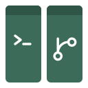
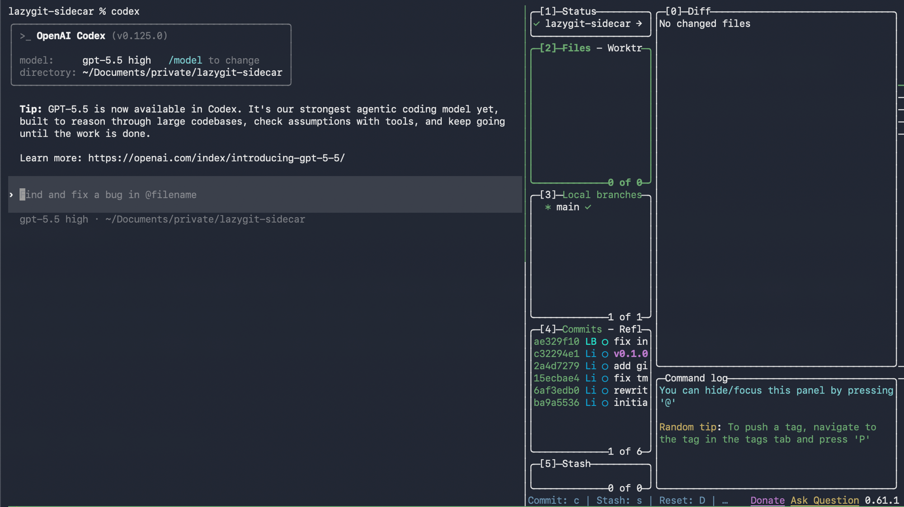

<p align="center">
  
</p>

<h1 align="center">lazygit-sidecar</h1>

<p align="center">
  See your git changes while you code. Always.
</p>

<p align="center">
  
</p>

## What is this?

When you work in the terminal, you constantly switch between your tool and git commands. lazygit-sidecar solves this by splitting your terminal in two: your tool on the left, a live git view on the right. Outside a git repository, your tool runs normally without any split.

It works with any command-line tool: [Claude Code](https://claude.ai/code), [Codex](https://github.com/openai/codex), [Gemini CLI](https://github.com/google-gemini/gemini-cli), or just a plain shell.

## Install

macOS and Linux are supported natively. On Windows, lazygit-sidecar works inside [WSL](https://learn.microsoft.com/en-us/windows/wsl/install).

Make sure you have [tmux](https://github.com/tmux/tmux) (3.1 or newer), [lazygit](https://github.com/jesseduffield/lazygit), and bash (3.2 or newer, so macOS's built-in bash is fine) installed, then run:

```sh
git clone https://github.com/Predixx/lazygit-sidecar.git
cd lazygit-sidecar
./install.sh
```

The installer walks you through every step and asks for confirmation before making any changes.

<details>
<summary><strong>Non-interactive install</strong></summary>

If you prefer to skip the prompts:

```sh
./install.sh --core
```

</details>

<details>
<summary><strong>Manual install</strong></summary>

```sh
install -m 0755 bin/lazygit-sidecar ~/.local/bin/lazygit-sidecar
```

If your terminal says `lazygit-sidecar: command not found`, add this line to your `~/.zshrc` (or `~/.bashrc`):

```sh
export PATH="$HOME/.local/bin:$PATH"
```

</details>

## Usage

Just put `lazygit-sidecar` in front of the command you normally use:

```sh
lazygit-sidecar claude
lazygit-sidecar codex
lazygit-sidecar zsh
```

That's it. Your terminal splits in two. Work on the left, git on the right.

When you're done, exit your tool as usual. Close the git view by pressing `q`.

> **Note:** lazygit-sidecar only opens the git view when you are inside a git repository. Outside of a git repo, your command runs normally in a plain terminal session without any split.

## Width of the git view

The git view takes 30% of the terminal width by default. Pick a different width at install time:

```sh
./install.sh --width 20
```

Combine `--width` with any install mode (`--core`, `--agent-deck`, `--all`), and re-run it whenever you want a different width. The interactive installer asks for it too.

For a single run, set `LAZYGIT_SIDECAR_WIDTH` (1-99); it overrides the installed width:

```sh
LAZYGIT_SIDECAR_WIDTH=50 lazygit-sidecar claude
```

If you use the agent-deck integration, you can also change the width of the next split without reinstalling:

```sh
tmux set -g @lazygit-sidecar-width 20
```

Any value outside 1-99 is ignored and the default is used.

<details>
<summary><strong>Where the width is stored</strong></summary>

`--width` writes to the two places that are actually read at runtime:

- the copy of `lazygit-sidecar` in `~/.local/bin` gets the value as its built-in default (the script in this repo stays at 30);
- the agent-deck hook gets it from the `@lazygit-sidecar-width` tmux option in the installer's `~/.tmux.conf` block.

The hook needs the tmux option because a `run-shell` hook is executed by the tmux server and does not see the environment of the shell you are attaching from.

</details>

## Uninstall

```sh
./install.sh --uninstall
```

<details>
<summary><strong>Troubleshooting</strong></summary>

**`lazygit-sidecar: command not found`**
`~/.local/bin` is likely not on your PATH. See the fix in [Install](#install).

**`already inside a tmux session`**
lazygit-sidecar opens its own terminal session and can't run inside one that's already open. Press `Ctrl-b d` to leave the current session first, then try again.

**`tmux 3.1+ required`**
Your tmux version is too old. Update it with `brew upgrade tmux`.

**No git view appeared**
The git view only opens inside a git repository. Navigate to a folder that contains a `.git` directory (or is inside one) and try again. You can check with `git rev-parse --is-inside-work-tree`.

</details>

<details>
<summary><strong>agent-deck integration</strong></summary>

If you use [agent-deck](https://github.com/asheshgoplani/agent-deck), you can add a hook so that every agent-deck session automatically gets a git view on attach:

```sh
./install.sh --agent-deck
```

This installs a tmux hook and an `ad()` shell alias. All changes are wrapped in markers and can be cleanly removed with `./install.sh --uninstall-agent-deck`.

</details>

<details>
<summary><strong>How it works</strong></summary>

The entire tool is a single short shell script. When you run it:

1. It opens a new terminal session (using tmux).
2. Your command runs in the left side.
3. If the current directory is inside a git repository, lazygit opens on the right side (taking up 30% of the width by default). Outside a git repo, no split happens and your command runs full-width.
4. When both sides are closed, you're back to your normal terminal.

No background processes, no daemons, and no config file of its own.

</details>

## License

[MIT](LICENSE)
